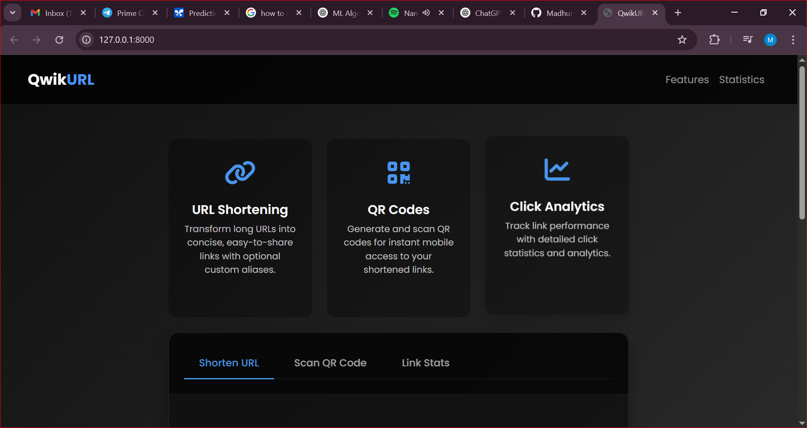
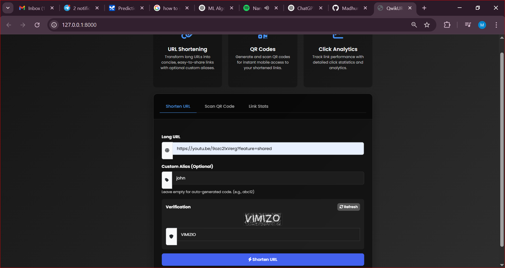
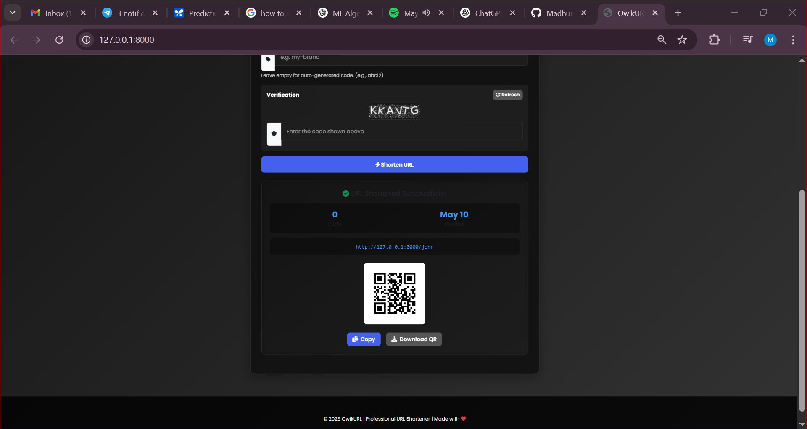
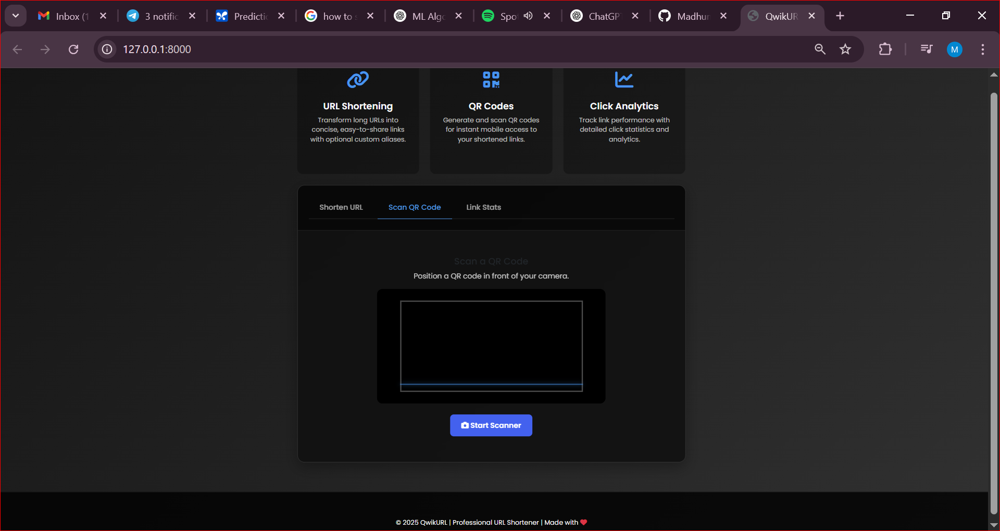
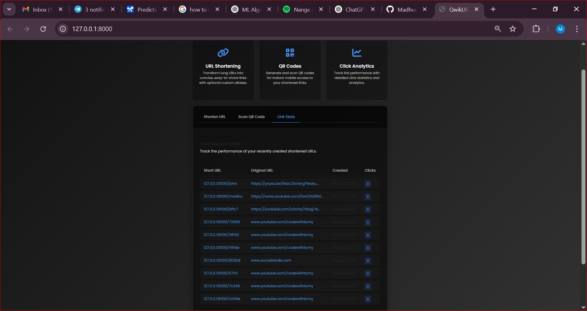

# QwikURL - URL Shortener Web App

QwikURL is a professional and user-friendly URL shortening service built with the goal of transforming long URLs into short, shareable links. It includes advanced features like custom aliases, QR code generation, and click analytics for tracking performance.

## 🔗 Features

- **URL Shortening**: Convert long URLs into concise, easy-to-share links.
- **Custom Alias Support**: Add your own alias (e.g., `/john`) or generate one automatically.
- **QR Code Generation**: Instantly generate QR codes for your shortened links.
- **Click Analytics**: View click statistics and performance tracking for each URL.
- **Verification Code System**: Protect link creation with CAPTCHA-style verification.

## 📸 Screenshots

### Homepage Interface


### URL Shortening Form with Custom Alias


### Verification Page


### QR and Analytics Page


### Link Stats Dashboard


## 🚀 Getting Started

### Prerequisites

- Python 3.x
- Django
- SQLite (or any database of your choice)
- Pillow (for QR code rendering)


### Installation

1. **Clone the repository**:
   ```bash
   git clone https://github.com/MadhumithaRAmalkar/QwikURL.git
   cd QwikURL
   ```

2. **Install dependencies**:
   ```bash
   pip install -r requirements.txt
   ```

3. **Apply migrations**:
   ```bash
   python manage.py migrate
   ```

4. **Run the development server**:
   ```bash
   python manage.py runserver
   ```

## 🌐 Usage

1. Navigate to `http://127.0.0.1:8000/`
2. Enter the long URL.
3. Optionally add a custom alias.
4. Complete the verification and submit.
5. Use the shortened URL and monitor its performance.

## 🛠️ Built With

- **Python & Django** – Web framework
- **HTML/CSS & Bootstrap** – Frontend styling
- **Pillow** – For generating QR codes
- **SQLite** – Database (default for development)

## 📈 Example Stats

| Short URL             | Original URL                                      | Clicks |
|----------------------|----------------------------------------------------|--------|
| 127.0.0.1:8000/john   | https://youtu.be/9ozc2IxVerg?feature              | 0      |
| 127.0.0.1:8000/madhu  | https://www.youtube.com/live/GSZRM...            | 2      |
| 127.0.0.1:8000/btte7  | https://youtube.com/shorts/rIkeg7w...            | 0      |

## 📄 License

This project is licensed under the MIT License - see the [LICENSE](LICENSE) file for details.

---

© 2025 QwikURL | Made with ❤️ by Madhu
